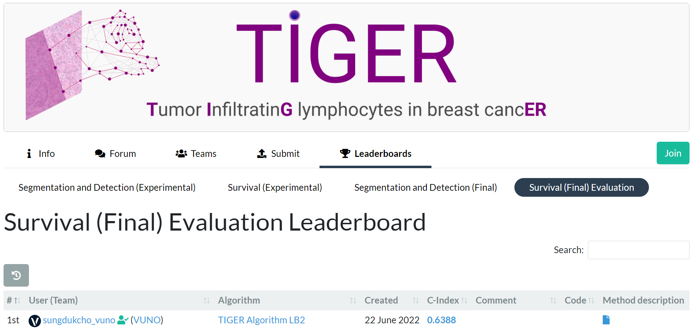
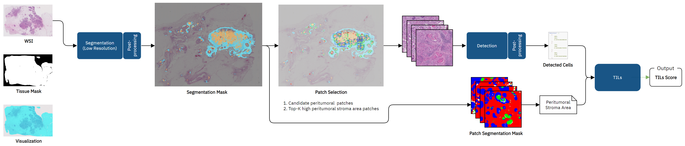

# TIGER Algorithm

### Challenge Achievement
Our algorithm ranked 1st in [Survival (Final) Evaluation](https://tiger.grand-challenge.org/evaluation/survival-final-evaluation/leaderboard/).

    
Leaderboard Screenshot

### Pretrained Model Weights

- Download pretrained model weights from https://doi.org/10.5281/zenodo.8112147 (Licensed under CC BY-NC 4.0).
- Place the downloaded folder (`pretrained_weights/`) into root path (`./`).

### Overall pipeline

### Method description

Detailed description of our method is found [here](figure/method_description.pdf).

### Environment

- `Ubuntu 20.04`

## Summary of the modules

Used docker related codes and algorithm template from the [official example](https://github.com/DIAGNijmegen/pathology-tiger-algorithm-example).

- `algorithm:` entry point of the algorithm (modified official example code)
- `configuration/`: contains codes for configuration
- `detection/`: contains codes for detection model
- `pipeline/`: contains codes for TILs inference pipeline
- `pretrained weights/`: contains pretrained weights for detection and segmentation models
- `segmentation/`: contains codes for segmentation model
- `tils/`: contains codes to process for TILs inference
- `./`: contains codes for docker

## Notice

This repository is provided as-is and is not actively maintained.